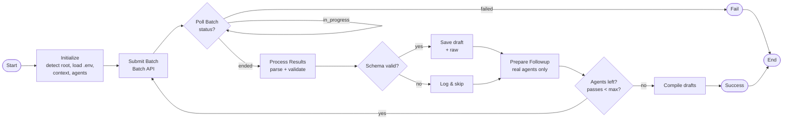

# PRP Draft Workflow (Mermaid)

Notes:
- Draft responses are validated against the strict Pydantic schema; invalid payloads are logged and excluded.
- Follow-up batches only include known agents (task-like IDs are dropped).
- Batch polling uses exponential backoff until `ended` or `failed`.
