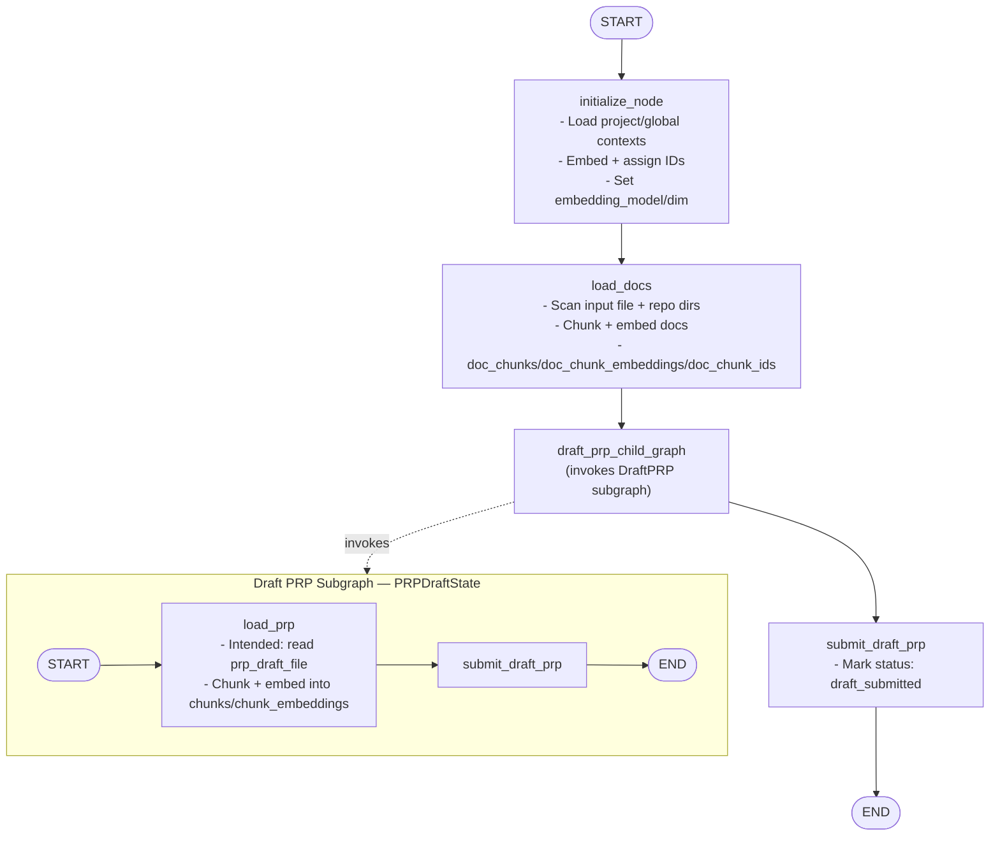

## PRP Workflow (current state)


````markdown
## Full Process (current wiring)

```mermaid
flowchart TB
  %% Main PRP Workflow (PRPState)
  subgraph Main["Main PRP Workflow — PRPState"]
    A_START([START]) --> INIT["initialize_node\n- Load project/global\n- Chunk + embed\n- IDs + embedding metadata"]
    INIT --> LOAD["load_docs\n- Scan input + repo\n- Chunk + embed corpus\n- doc_* fields"]
    LOAD --> DRAFT["draft_prp_child_graph\n- Attempts to invoke Draft PRP Subgraph"]
    DRAFT --> SUBMIT["submit_draft_prp\n- Mark status: draft_submitted"]
    ## PRP Workflow (current state)

    ```mermaid
    flowchart TD
      %% Main PRP Workflow (PRPState)
      A_START([START]) --> A_INIT["initialize_node<br/>- Load project/global contexts<br/>- Embed + assign IDs<br/>- Set embedding_model/dim"]
      A_INIT --> A_LOAD["load_docs<br/>- Scan input file + repo dirs<br/>- Chunk + embed docs<br/>- doc_chunks/doc_chunk_embeddings/doc_chunk_ids"]
      A_LOAD --> A_DRAFT["draft_prp_child_graph<br/>(invokes DraftPRP subgraph)"]
      A_DRAFT --> A_SUBMIT["submit_draft_prp<br/>- Mark status: draft_submitted"]
      A_SUBMIT --> A_END([END])

      %% Draft PRP Subgraph (PRPDraftState)
      subgraph B_DRAFT_SUBGRAPH["Draft PRP Subgraph — PRPDraftState"]
        direction LR
        B_START([START]) --> B_LOAD["load_prp<br/>- Intended: read prp_draft_file<br/>- Chunk + embed into chunks/chunk_embeddings"]
        B_LOAD --> B_SUBMIT["submit_draft_prp"]
        B_SUBMIT --> B_END([END])
      end

      %% Invocation (conceptual link)
      A_DRAFT -. invokes .-> B_DRAFT_SUBGRAPH
    ```

    ## Full Process (current wiring)

    ```mermaid
    flowchart TB
      %% Main PRP Workflow (PRPState)
      subgraph Main["Main PRP Workflow — PRPState"]
        A_START([START]) --> INIT["initialize_node<br/>- Load project/global<br/>- Chunk + embed<br/>- IDs + embedding metadata"]
        INIT --> LOAD["load_docs<br/>- Scan input + repo<br/>- Chunk + embed corpus<br/>- doc_* fields"]
        LOAD --> DRAFT["draft_prp_child_graph<br/>- Attempts to invoke Draft PRP Subgraph"]
        DRAFT --> SUBMIT["submit_draft_prp<br/>- Mark status: draft_submitted"]
        SUBMIT --> A_END([END])
      end

      %% Draft PRP Subgraph (PRPDraftState)
      subgraph Draft["Draft PRP Subgraph — PRPDraftState"]
        direction LR
        B_START([START]) --> B_LOAD["load_prp<br/>- Read prp_draft_file<br/>- Chunk + embed into draft chunks"]
        B_LOAD --> B_SUBMIT["submit_draft_prp"]
        B_SUBMIT --> B_END([END])
      end

      %% Data sources and stores
      InputFile["input_file<br/>(prp/test_prp.md)"]
      Repo["project repo<br/>(docs/, contracts/, ...)"]
      GlobalFile["~/.claude/CLAUDE.md"]
      RepoClaude["CLAUDE.md in repo"]
      Cache["Embedding cache<br/>.emb_cache/"]

      %% Flows to nodes
      InputFile --> LOAD
      Repo --> LOAD
      RepoClaude --> INIT
      GlobalFile --> INIT
      INIT --> Cache
      LOAD --> Cache

      %% Invocation (conceptual link)
      DRAFT -. invokes .-> Draft

      classDef data fill:#eef,stroke:#88a,stroke-width:1px,color:#000;
      classDef store fill:#efe,stroke:#8a8,stroke-width:1px,color:#000;
      class InputFile,Repo,GlobalFile,RepoClaude data;
      class Cache store;
    ```

    ## Glue Node Pattern (recommended wiring)

    ```mermaid
    flowchart TB
      %% Main PRP Workflow with glue node
      subgraph MainGlue["Main PRP Workflow — with glue node"]
        S([START]) --> INIT[initialize_node]
        INIT --> LOAD[load_docs]
        LOAD --> GLUE["run_draft_phase<br/>- Build PRPDraftState from PRPState<br/>- Invoke Draft subgraph<br/>- Merge selected outputs back"]
        GLUE --> SUBMIT_MAIN[submit_draft_prp]
        SUBMIT_MAIN --> E([END])
      end

      %% Draft PRP Subgraph invoked by GLUE
      subgraph DraftSub["Draft PRP Subgraph — PRPDraftState"]
        direction LR
        DS([START]) --> LPRP[load_prp]
        LPRP --> DRAFT_STEP[draft_iterate]
        DRAFT_STEP --> DE([END])
      end

      %% Conceptual invocation from glue node
      GLUE -. invokes .-> DraftSub
    ```